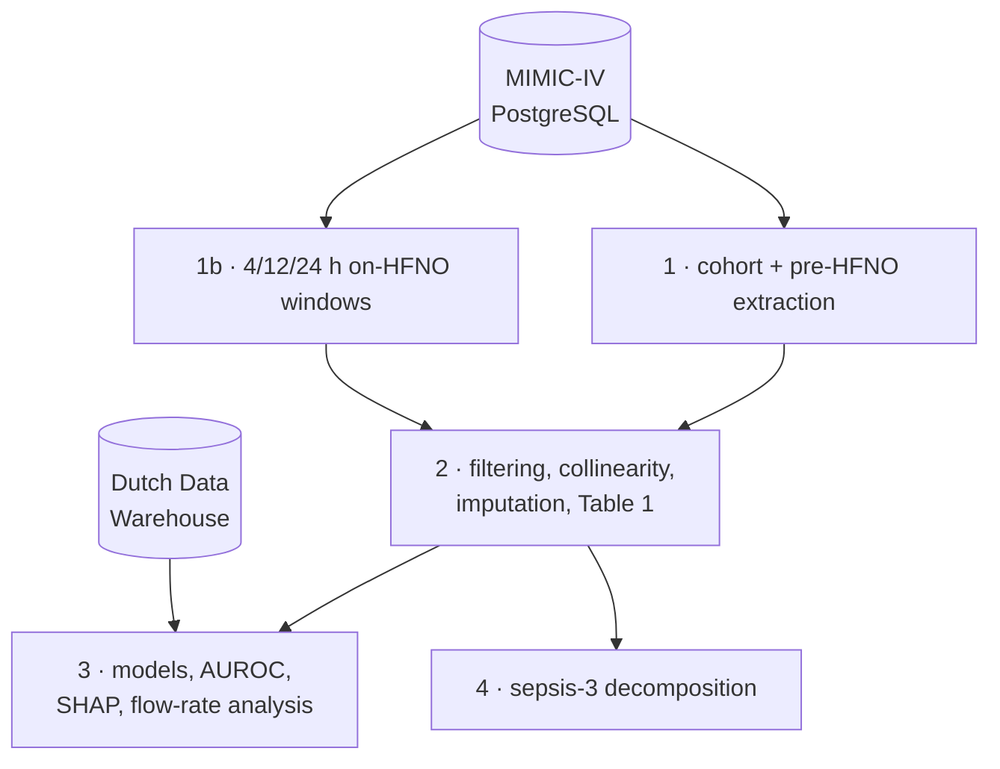

# Robust prediction of HFNO failure before and after therapy initiation
## Predicting HFNO failure - before starting HFNO


Most tools for predicting high-flow nasal oxygen (HFNO) failure wait until the
therapy is already running, then watch how the patient responds - the ROX index
and its descendants. This study asked a different question: **how much can you
know before you ever switch the machine on?**

Across 1,609 ICU patients in MIMIC-IV a model
using only pre-initiation data matched the best models that had 24 hours of
on-therapy measurements to work with. And the predictors that carried it were not
novel signals - sepsis, organ dysfunction, fluid balance, oxygenation,
neurological status. The things clinicians already use to judge whether someone
will manage without ventilatory support.

## Headline results

Five prediction scenarios, four classifiers each. AUROC of the best classifier
(XGBoost in every case):

| Model | Data available | Variables | AUROC |
| --- | --- | --- | --- |
| 1 | 4 h on-HFNO only *(the conventional approach)* | 36 | 0.77 |
| 2 | 24 h pre-HFNO + 4 h on-HFNO | 60 | 0.81 |
| 3 | 24 h pre-HFNO + 12 h on-HFNO | 65 | 0.81 |
| 4 | 24 h pre-HFNO + 24 h on-HFNO | 72 | 0.81 |
| **5** | **24 h pre-HFNO only** | **49** | **0.82** |

Model 5 sees no flow rate. Widening the on-therapy window from
4 to 24 hours (Models 2→4) buys nothing.

Two further findings:

- **Flow rate is a marker, not a mechanism.** A maximum flow ≥40 L/min carried a
  hazard ratio of 4.99 (2.30–10.84) for failure and survived propensity score
  matching — yet never ranked among the top predictors. Confounding by
  indication: sicker patients need more flow.
- **Sepsis does not decompose.** The sepsis-3 score was the single most
  influential predictor, but splitting it into its component subscores dissolved
  the signal (AUROC 0.71). The systemic burden lives in the composite.

External validation on 239 COVID-19 patients from the Dutch Data Warehouse gave
an AUROC of 0.64 (0.52–0.75) — modest, and discussed as such in the paper.

## Pipeline



| Notebook | What it does |
| --- | --- |
| `1_MIMICIV_HFNO_data_extraction.ipynb` | Builds the cohort, extracts pre-initiation variables |
| `1b_HFNO_post_initiation_extraction.ipynb` | Extracts the 4/12/24-hour on-HFNO windows |
| `2_HFNO_data_processing.ipynb` | Exclusions, collinearity pruning, median imputation, Table 1 |
| `3_HFNO_predictor_analysis.ipynb` | Model training, AUROC comparison, SHAP, propensity matching |
| `4_HFNO_sepsis3_contribution_analysis.ipynb` | Decomposition of the sepsis-3 score |

| Module | Contents |
| --- | --- |
| `experiment_config.py` | Cohort settings, non-normal and collinear variable lists, `FORMAT_PARAMS` |
| `dataset_features.py` | Feature groupings by time window |
| `utils.py` | Shared helpers, including the `tableone` wrapper |

## Data access

**No patient data is in this repository, and none may be added to it.** Both
sources are credentialed:

- **MIMIC-IV** — apply via [PhysioNet](https://physionet.org/content/mimiciv/).
  Requires CITI training and a signed data use agreement.
- **Dutch Data Warehouse** — access governed by the DDW consortium.

`filtered_data/`, `processed_data/` and `results/` are git-ignored because they
hold patient-level extracts. Recreate them by running the pipeline against your
own MIMIC database.

## Setup

```bash
python3.12 -m venv hfno_venv
source hfno_venv/bin/activate      # or: hfno_venv/Scripts/activate
pip install -r requirements.txt
```

Python 3.10+ is required (one dependency insists on it). If conda is also
installed you may see `(hfno_venv)` and `(base)` active together — run
`conda deactivate` until only `(hfno_venv)` remains.

Connection details are read from the environment, so no credentials live in the
code:

```bash
export MIMIC_DB=mimiciv MIMIC_USER=postgres MIMIC_PASSWORD=... \
       MIMIC_HOST=localhost MIMIC_PORT=5432
```

Then run the notebooks in order.

## If you reuse this code

`FORMAT_PARAMS` is defined once, in `experiment_config.py`. One trap is worth
knowing about: **`tableone` matches categorical levels as strings.** The entries
in `FORMAT_PARAMS['order']` must therefore be quoted —

```python
'sepsis3': ['1', '0']     # correct
'sepsis3': [1, 0]         # silently wrong
```

With integers the lookup fails, `tableone` emits an easily-missed
`Order value not found` warning and falls back to sorted order. Every binary
variable is then reported at level 0 — the count of patients *without* the
characteristic, under a label that reads as though they had it. It inverts an
entire baseline table without ever raising an error.

## Citation

> Hilders P, Lijović L, Elbers P. Robust prediction of HFNO failure before and
> after therapy initiation. *Manuscript under review.*
